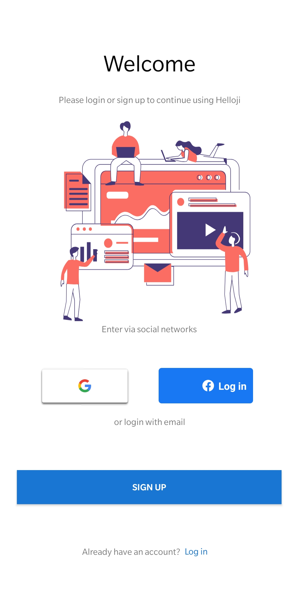

# Authentication

## Technology Used
1. Android
2. Java
3. XML
4. Firebase

## Limitations
1. Internet connection is must for running the app.

### Follow the Working section to see the functionality of the app.

## Screenshots

## Working
1. User signs up to the application with Sign-up Verification provided by firebase and gets registered in DB, options for signup are:
  a. Google auth
  b. Facebook auth
  c. Email-Password
2. User Verification using phone OTP
3. Details are sent to the DB i.e. Firebase Firestore.
4. On the off chance that user wants to signout he/she can 'Logout'.
